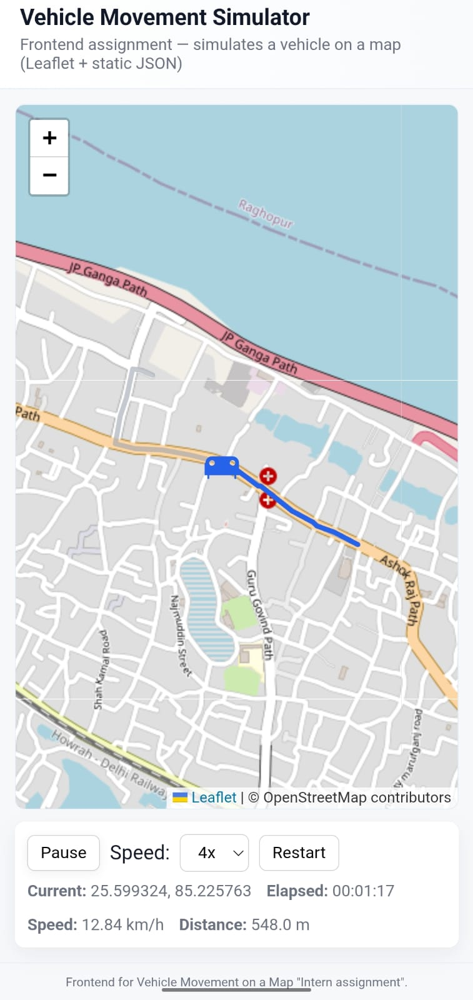
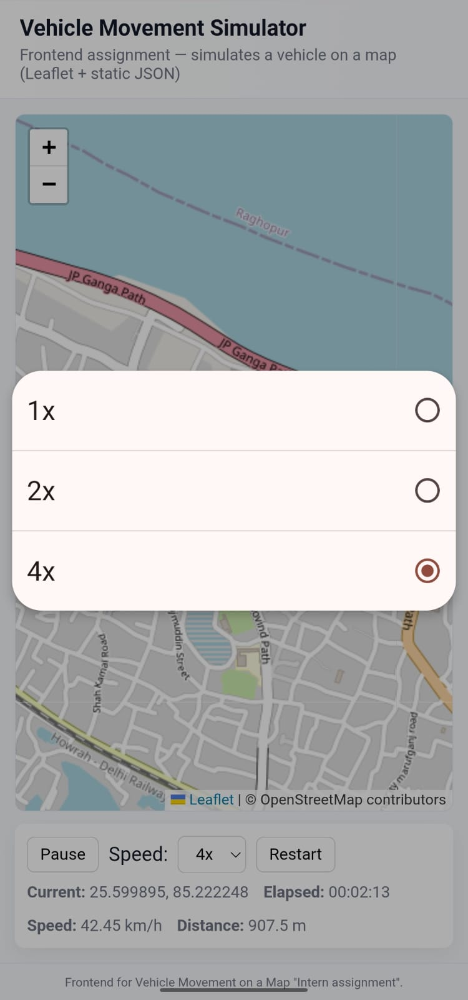
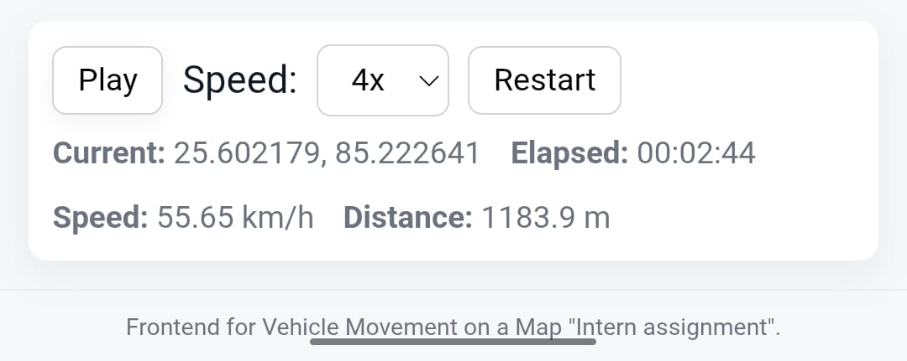

# Vehicle Route Simulation — 

A web-based vehicle movement simulator built with **Leaflet.js** and OpenStreetMap, created for the Frontend Developer Intern assignment.  
The simulation uses a `dummy-route.json` file with latitude/longitude waypoints to animate a vehicle moving along a predefined route in Patna City.

## 🚀 Live Demo
[🔗 View on GitHub Pages](https://aditya-ganglia.github.io/VehicleMovementSimulator/)  


## 📂 Project Structure
- index.html # Main HTML file
- style.css # Styling for layout and responsive UI
- script.js # Simulation logic & Leaflet integration
- dummy-route.json # Route coordinates with timestamps
- README.md # Project documentation


## 📜 Features
- Interactive Map — Powered by Leaflet.js and OpenStreetMap tiles.
- Real Road Route — Waypoints follow streets between Patna Sahib Gurdwara and Infant Jesus' School.
- Simulated Real-Time Movement — Vehicle marker moves smoothly between points.
- Live Stats Display — Shows current coordinates, elapsed time, speed, and distance.
- Controls — Play/Pause, Restart, and speed multiplier (1x, 2x, 4x).
- Responsive UI — Works on desktop and mobile.

## 🛠 Technologies Used
- HTML5  
- CSS3  
- JavaScript (Vanilla JS)  
- [Leaflet.js](https://leafletjs.com/)  
- OpenStreetMap tiles  

## 📷 Preview

  
  



## 📦 How to Run Locally

1. **Clone this repository**  
   ```bash
   git clone https://github.com/Aditya-Ganglia/VehicleMovementSimulator.git
   cd VehicleMovementSimulator

2. **Start a local server (because fetch() requires HTTP/HTTPS): using Python**
   ```bash
   python -m http.server 8000

   Then open: http://localhost:8000 in your browser

3. **Run the simulation**
   -Click Play to start the vehicle movement.
   -Use the controls to Pause, Restart, or change the speed multiplier.

## 👤 Author
**Aditya Kumar**  
Frontend Developer Intern Candidate  
📧 adiemit23@gmail.com
